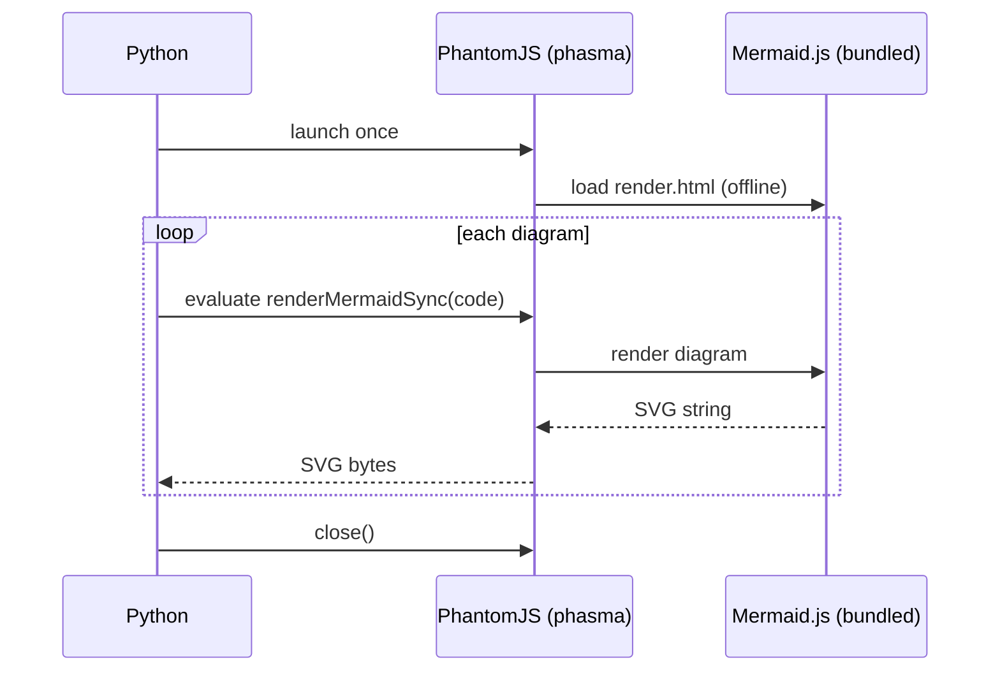

# mmdc — Mermaid Diagram Converter for Python

[](https://pypi.org/project/mmdc)
[](https://pypi.org/project/mmdc)
[](https://opensource.org/licenses/MIT)
[](https://github.com/MohammadRaziei/mmdc/actions/workflows/wheel.yml)

<div align="center">

</div>

Convert Mermaid diagrams to SVG, PNG, and PDF — **fully offline, just `pip install`**.

No Node.js. No npm. No Chrome. No system packages. Powered by [phasma](https://pypi.org/project/phasma/).

---

## Why mmdc?

The official Mermaid CLI (`@mermaid-js/mermaid-cli`) requires Node.js and npm. If you're working in a Python environment, that's a significant dependency just to render a diagram.

`mmdc` brings the same functionality to Python with a single pip install. The Mermaid JS library and PhantomJS binary are both bundled inside the wheel — no network access needed after install.

---

## Installation

```bash
pip install mmdc
```

**Requirements:** Python 3.10+

---

## Quick Start

```python
import asyncio
from mmdc import MermaidConverter

async def main():
    async with MermaidConverter() as m:
        await m.to_svg("graph TD\n    A-->B", output="diagram.svg")
        await m.to_png("graph TD\n    A-->B", output="diagram.png", scale=2.0)
        await m.to_pdf("graph TD\n    A-->B", output="diagram.pdf")

asyncio.run(main())
```

```bash
mmdc -i diagram.mermaid -o diagram.svg
mmdc -i diagram.mermaid -o diagram.png --scale 2.0
cat diagram.mermaid | mmdc -i - -o diagram.pdf
```

---

## Python API

### `MermaidConverter`

One `MermaidConverter` = one persistent PhantomJS process reused for all conversions.

```python
async with MermaidConverter(theme="default", background="white") as m:
    ...
```

Or manage lifecycle manually:

```python
m = MermaidConverter()
await m.start()
svg = await m.to_svg("graph TD\n    A-->B")
await m.close()
```

### Methods

#### `to_svg(source, output?, *, theme?, background?, config?, css?)`

```python
svg_bytes = await m.to_svg("graph TD\n    A-->B")
svg_bytes = await m.to_svg(Path("diagram.mermaid"), "out.svg", theme="dark")
```

#### `to_png(source, output?, *, scale?, theme?, background?, config?, css?)`

```python
png_bytes = await m.to_png("graph TD\n    A-->B", scale=2.0)
await m.to_png(Path("diagram.mermaid"), "out.png", scale=3.0, theme="forest")
```

#### `to_pdf(source, output?, *, scale?, theme?, background?, config?, css?, pdf_format?, pdf_landscape?, pdf_margin?)`

```python
# fit paper to diagram size (default)
pdf_bytes = await m.to_pdf("graph TD\n    A-->B")

# standard paper format
await m.to_pdf("graph TD\n    A-->B", "out.pdf", pdf_format="A4", pdf_landscape=True)
```

#### `convert(source, output?, ...)`

Auto-detects format from file extension:

```python
await m.convert("graph TD\n    A-->B", "out.svg")   # → SVG
await m.convert("graph TD\n    A-->B", "out.png")   # → PNG
await m.convert("graph TD\n    A-->B", "out.pdf")   # → PDF
```

### Parameters

| Parameter | Type | Description |
|---|---|---|
| `source` | `str \| Path` | Mermaid string, `.mermaid` file path, or `Path` object |
| `output` | `str \| Path \| None` | Output file path. If omitted, returns bytes |
| `scale` | `float` | Size multiplier for PNG/PDF (default: `1.0`) |
| `theme` | `str` | `"default"`, `"forest"`, `"dark"`, `"neutral"` |
| `background` | `str` | CSS background color (default: `"white"`) |
| `config` | `dict` | Mermaid config dict |
| `css` | `str` | CSS string injected into the diagram |
| `pdf_format` | `str \| None` | `"A4"`, `"Letter"`, etc. `None` = fit to diagram |
| `pdf_landscape` | `bool` | Landscape orientation (PDF only) |
| `pdf_margin` | `str` | CSS margin e.g. `"1cm"` (default: `"0"`) |

---

## CLI

```bash
# basic usage
mmdc -i diagram.mermaid -o diagram.svg
mmdc -i diagram.mermaid -o diagram.png
mmdc -i diagram.mermaid -o diagram.pdf

# read from stdin
cat diagram.mermaid | mmdc -i - -o diagram.svg

# scale (PNG/PDF)
mmdc -i diagram.mermaid -o diagram.png --scale 2.0

# theme
mmdc -i diagram.mermaid -o diagram.svg --theme dark

# background
mmdc -i diagram.mermaid -o diagram.png --background "#f5f5f5"

# PDF options
mmdc -i diagram.mermaid -o diagram.pdf --pdf-format A4 --landscape --margin 1cm

# custom config and CSS
mmdc -i diagram.mermaid -o diagram.svg --config config.json --css style.css

# version
mmdc --version
```

---

## Examples

### Flowchart

```
graph TD
    A[Start] --> B{Decision}
    B -->|Yes| C[Action]
    B -->|No| D[Skip]
    C --> E[End]
    D --> E
```

### Sequence Diagram

```
sequenceDiagram
    participant Alice
    participant Bob
    Alice->>Bob: Hello Bob!
    Bob-->>Alice: Hi Alice!
```

### Batch conversion

```python
from pathlib import Path
import asyncio
from mmdc import MermaidConverter

async def main():
    diagrams = Path("diagrams").glob("*.mermaid")

    async with MermaidConverter(theme="forest") as m:
        for f in diagrams:
            await m.to_png(f, f.with_suffix(".png"), scale=2.0)

asyncio.run(main())
```

One PhantomJS process handles all files — no per-file restarts.

---

## How It Works



The Mermaid JS library (`mermaid.min.js`) is bundled inside the package — no CDN, no internet required.

---

## Testing

```bash
pip install -e ".[dev]"
pytest tests/ -v
```

---

## Contributing

1. Fork and create a feature branch
2. Add tests for new functionality
3. Run `pytest tests/` — all must pass
4. Open a pull request

---

## License

MIT — see [LICENSE](LICENSE) for details.

---

<div align="center">
Powered by <a href="https://pypi.org/project/phasma/">phasma</a> &nbsp;·&nbsp;
Made by <a href="https://github.com/MohammadRaziei">Mohammad Raziei</a>
</div>