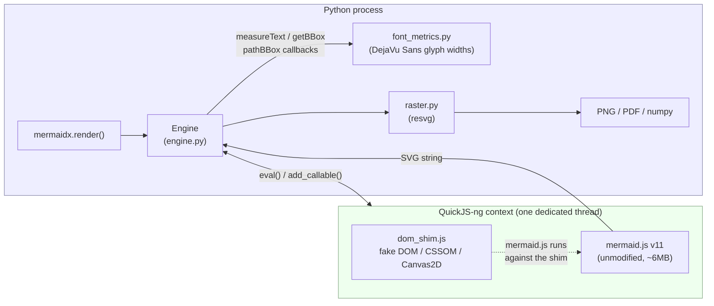
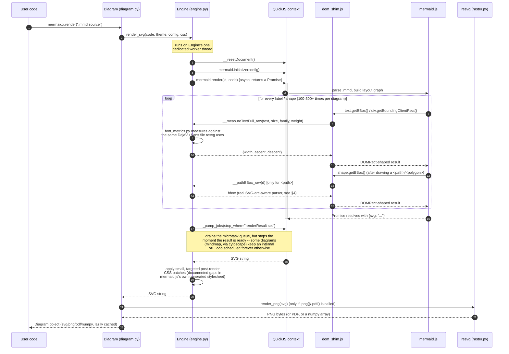
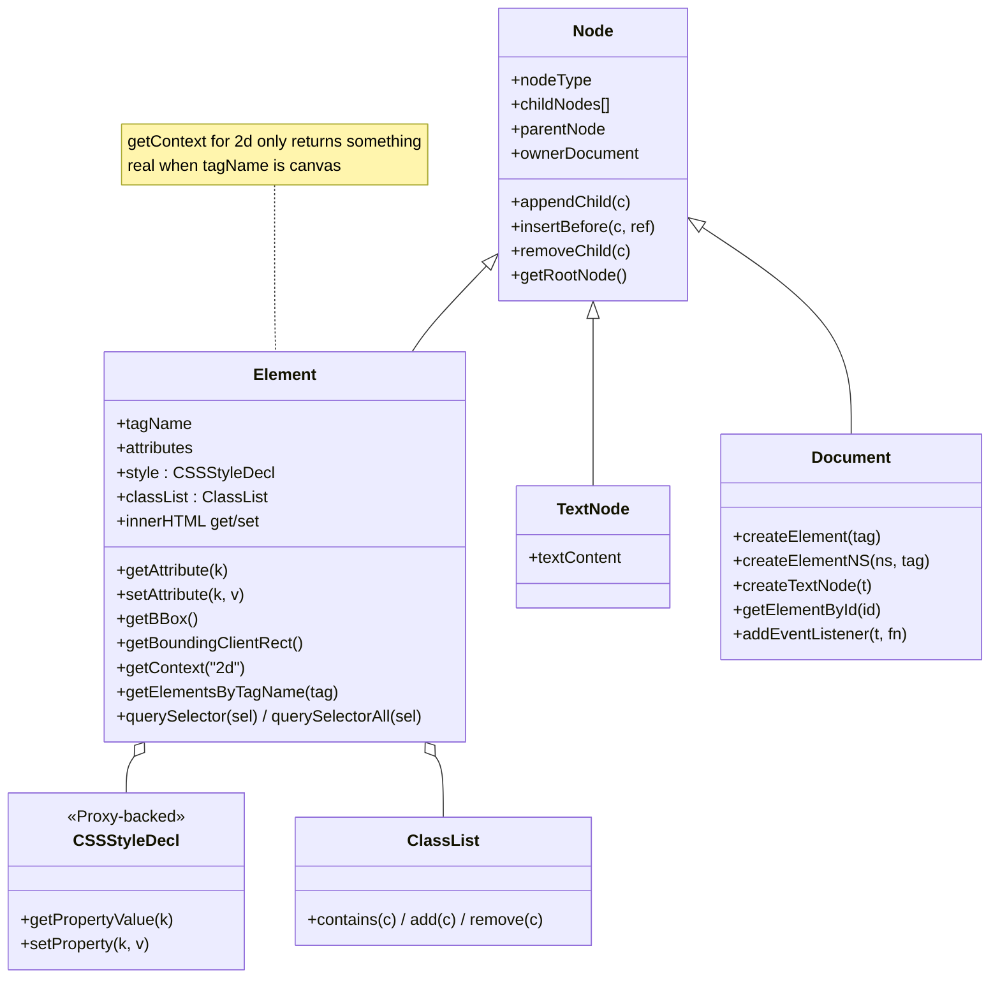
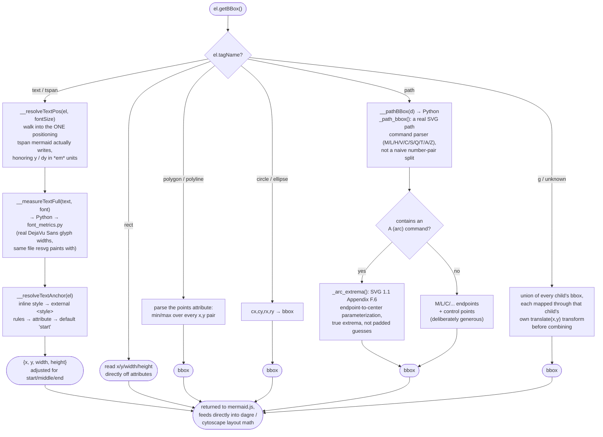
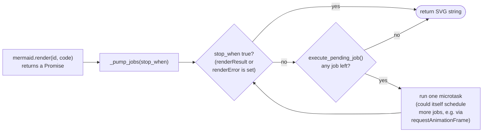
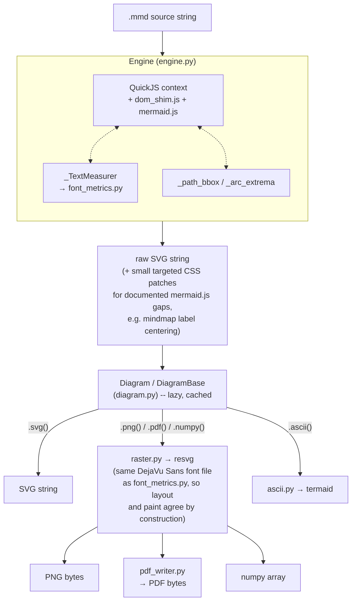

# mermaidx architecture

This document explains how `mermaidx` turns a `.mmd` source string into SVG/PNG/PDF/ASCII **without a browser** — the core trick, the two files that do almost all of the work (`engine.py` and `assets/dom_shim.js`), and the algorithm behind the single hardest part: making a fake DOM answer layout questions (`getBBox()`, `getBoundingClientRect()`, `getContext("2d").measureText()`) correctly enough that mermaid.js's own layout engine (dagre / cytoscape) produces the same result it would in a real browser.

Diagrams in this file are plain Mermaid, rendered by GitHub natively — and, of course, by `mermaidx` itself.

---

## 1. The core idea

mermaid.js is a real, unmodified npm package — not a reimplementation, not a subset. It's JavaScript, and it expects to run in a browser: it wants `document.createElementNS`, `getBBox()`, a `<canvas>` it can call `getContext("2d")` on, `requestAnimationFrame`, and so on.

`mermaidx` gives it all of that — except there's no browser underneath. There's a small, embeddable JS engine (**QuickJS-ng**) running a **hand-written fake DOM** (`dom_shim.js`, ~765 lines). mermaid.js can't tell the difference, as long as the fake DOM answers its questions the way a real one would.

**Why this instead of Puppeteer/Chrome (what the official `mermaid-cli` does):** no browser to install or boot means far less startup cost per render, no Chromium download, and no OS-specific browser-automation flakiness. The trade-off is that a fake DOM has to *actually be correct* — every gap between it and a real browser's behavior becomes a rendering bug. Most of the interesting engineering in this project is closing those gaps, described below.

---

## 2. End-to-end sequence: one `render()` call

Two things worth noticing:

- **The callback bridge (steps 6-13) is the hot path.** A single moderately complex diagram makes 100-300+ round trips from JS into Python and back, each one answering "how big is this text/shape". This is also *why* a from-scratch C++ rewrite (discussed in `architecture-notes`/project history) targets this bridge specifically rather than the JS engine choice — profiling showed ~98% of render time is this loop, not the final rasterization step.
- **The Promise chain has to be pumped manually** (`_pump_jobs`). QuickJS has no event loop of its own; `execute_pending_job()` runs one microtask at a time, and `Engine` calls it in a loop until the result is ready. Early on this loop had no early-exit condition and would drain a diagram type's entire internal animation-frame queue (hundreds of thousands of no-op iterations) even after the real answer was ready — see §5.

---

## 3. The DOM/CSSOM shim: class shape

`dom_shim.js` is a single file implementing just enough of the DOM, CSSOM, and Canvas 2D APIs for mermaid.js to run unmodified. It is **not** a general-purpose DOM implementation — every method exists because something in mermaid.js's actual bundle calls it.

Everything mermaid.js actually touches funnels through a handful of module-level functions rather than being spread across the classes above:

| Function | Role |
|---|---|
| `__computeBBox(el)` | The single most important function in the file — see §4. |
| `__resolveFont(el)` / `__resolveTextAnchor(el)` / `__resolveTextPos(el, fontSize)` | Walk up the ancestor chain (and, for text-anchor, into the parsed `<style>` block) to resolve *computed* font/anchor/position — a real DOM never asks the element itself, it asks "what does CSS say applies here". |
| `__getCssRules()` / `__resolveCssProp(el, prop)` | A tiny CSS parser + the same selector engine used for `querySelector`, reused to answer "what would `getComputedStyle` say" for the handful of properties mermaid's *layout* code actually reads (as opposed to properties that only affect paint, which resvg handles natively). |
| `__matches(el, sel)` / `__matchesCompound(el, part)` | A CSS selector engine covering descendant combinators, `.class`, `#id`, `[attr]`, and the pseudo-classes mermaid/d3 actually use (`:first-child`, `:last-child`, `:not(...)`) — enough for `d3.select(...).insert(tag, ":first-child")`, a pattern mermaid's shape-drawing code relies on constantly. |
| `__makeCanvas2dContext(canvasEl)` | A Canvas 2D stub: every drawing method (`fillRect`, `arc`, `bezierCurveTo`, ...) is a no-op, since mindmap's cytoscape-based layout never has its pixels read back — only `measureText()` is real, because layout math depends on it. |
| `__parseInto(parent, html)` / `__serialize(el, innerOnly)` | innerHTML get/set, used for mermaid's HTML-label code paths. |

---

## 4. The algorithm mermaid actually depends on: `getBBox()`

Every layout decision mermaid.js makes — how wide a node needs to be, where to center a label, how far apart to space two nodes — ultimately traces back to a `getBBox()` (or `getBoundingClientRect()`) call somewhere. Get this wrong and the *symptom* is never "getBBox is wrong" — it's "text is clipped", "two nodes overlap", or "a label sits outside its own shape". This is the function almost every bug fix in this project's history came back to.

Three of these branches are worth calling out because each one was, at some point, simply **absent** (silently falling through to the group-union branch and returning a zero-size box), and each absence produced a different, non-obvious visual symptom:

- **No `polygon` case** → `updateNodeBounds()` (mermaid's own function that reports a shape's final size back to its layout graph) always got `{width: 0, height: 0}` for any polygon-based shape (subroutine boxes, diamonds). The layout engine then placed every other node as if that shape took up no space at all — nodes overlapping, text stacked on text.
- **Naive `path` bbox** (flat number list split into alternating x/y pairs) → correct for `M`/`L`/`C` only. An `A` (arc) command has 7 numbers (`rx,ry,rotation,large-arc,sweep,x,y`), not 2 — desyncing the split for the rest of the path. Cylinder and stadium shapes (which use arcs for their rounded caps) got corrupted bounding boxes, clipping them off the edge of the final diagram.
- **Group bbox ignoring child transforms** → `getBBox()` on a `<g>` unioned its children's boxes *without* applying each child's own `transform="translate(x,y)"` first. Since mermaid positions essentially every node via exactly that attribute, the computed size of the whole diagram was close to the size of a single node at the origin — clipping almost everything else.

None of these are exotic: they're all direct consequences of the same principle — **a fake DOM's `getBBox()` has to implement the actual SVG geometry spec for each element type, not "the subset of cases the sample diagrams happened to exercise."**

---

## 5. Async without a browser: the job-pump model

QuickJS has no event loop, no timers, and no real 60fps frame clock. `requestAnimationFrame` and `setTimeout` are polyfilled (`dom_shim.js`, bottom), and `Engine._pump_jobs()` (`engine.py`) manually drains QuickJS's own Promise/microtask queue after kicking off `mermaid.render()`.

Two real bugs lived here:

1. **Synchronous rAF/setTimeout.** The first version ran the callback immediately, inline. In a real browser, a redraw handler that itself schedules another `requestAnimationFrame` unrolls across separate frames — the call stack unwinds in between. Run synchronously, that same pattern recurses directly: cytoscape's render loop (used by the mindmap diagram type) does exactly this, and it blew the JS call stack (`RangeError: Maximum call stack size exceeded`). Fix: defer both through `Promise.resolve().then(...)`, so each call becomes a fresh job on the microtask queue instead of a nested call.
2. **No early exit.** Even after (1), `_pump_jobs` drained the *entire* queue before returning. cytoscape's renderer keeps an animation loop scheduled indefinitely (correct behavior for a page that stays open — meaningless for a one-shot headless render). The actual SVG result was ready after ~150 jobs; the loop kept running until its 200,000-job safety cap, ~100x longer than necessary. Fix: `stop_when` — poll a JS boolean expression each iteration and return the moment it's true.

---

## 6. Where the layers hand off

`backends.py` sits alongside this as a pluggable second path: if the optional `mmdr` (native-Rust) package is installed, its backends (`merman`, `mermaid-rs-renderer`) are picked up automatically, each producing its own `.svg()`  — everything downstream of that (`.png()`, `.pdf()`, `.numpy()`) still goes through *this* project's `raster.py`/`pdf_writer.py`, since `DiagramBase` implements those once, shared by every backend.

---

## 7. File reference

| File | Responsibility |
|---|---|
| `mermaidx/engine.py` | Owns the QuickJS context (one per process, one dedicated thread). Wires up the Python↔JS callback bridge (`__measureText`, `__measureTextFull`, `__pathBBox`). Implements `_path_bbox`/`_arc_extrema` (real SVG path geometry). Drives the job-pump loop. Applies the small set of documented post-render CSS patches. |
| `mermaidx/assets/dom_shim.js` | The fake DOM/CSSOM/Canvas2D. `Node`/`Element`/`Document`/`TextNode`/`CSSStyleDecl`/`ClassList`. The `getBBox()` dispatch (§4). The CSS selector engine (`__matches`/`__matchesCompound`). The Canvas 2D stub. Timer/event polyfills. |
| `mermaidx/assets/mermaid.js` | mermaid.js v11, unmodified, bundled via esbuild. Never patched directly — every gap is compensated for in the shim or engine.py instead, so upgrading this file doesn't mean re-auditing hand-edits. |
| `mermaidx/font_metrics.py` | Reads real glyph advance widths from a bundled DejaVu Sans font file. The *only* source of text-measurement truth, shared by both the shim's `getBBox()` and (indirectly, via the same font file) resvg's final paint. |
| `mermaidx/raster.py` | SVG → PNG via resvg, using that same font file. |
| `mermaidx/pdf_writer.py` | PNG → PDF, hand-written (not resvg). |
| `mermaidx/diagram.py` | `DiagramBase`/`Diagram`/`DiagramRust` — the lazy, cached public object `render()` returns. |
| `mermaidx/backends.py` | Discovers optional `mmdr`-provided backends. |
| `mermaidx/ascii.py` | SVG → ASCII/Unicode art via `termaid`. |
| `tests/test_samples.py` | Structural checks (label text, aspect ratio) *and* geometry/pixel checks (content not clipped, shapes painted before labels, labels not stacked on siblings, label ink pixel-centered in its shape) — the geometry/pixel checks exist specifically because the structural ones are provably blind to whole classes of real rendering bugs. |

---

## 8. Design principles, stated explicitly

- **Never patch `mermaid.js` itself.** Every fix lives in `dom_shim.js` or `engine.py`. This means upgrading to a new mermaid.js release is a file swap, not a rebase of hand-edits — at the cost of occasionally needing a small compensating patch (§2, mindmap centering) when mermaid.js's own generated output has a gap that only shows up in the non-default (`htmlLabels:false`) configuration this project requires (`resvg` can't render `foreignObject`+HTML content, so `htmlLabels:false` isn't optional here).
- **One font, two consumers.** `font_metrics.py` and `raster.py` are handed the *same* DejaVu Sans font file. Layout (what mermaid.js's JS thinks a label's size is) and paint (what resvg actually draws) agree by construction, not by coincidence.
- **Implement real geometry, not special cases.** Every fix in §4 replaced an approximation with the actual spec-defined behavior (real SVG arc math, real CSS cascade lookup, real transform composition) rather than a targeted patch for one failing sample — verified, each time, by testing against synthetic inputs unrelated to any sample diagram.
